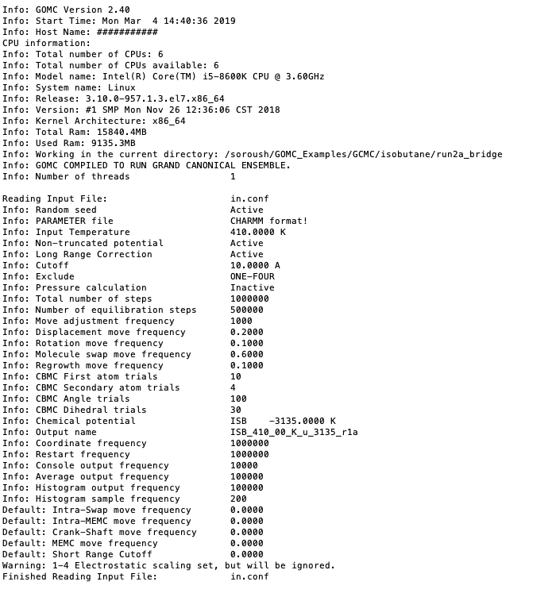

GOMC's Output Files, Terminal Output
====================================

GOMC currently supports several kinds of output:
  - STDIO ("console") output
  - File output

    – PDB

    – PSF

    – Block Averages

GOMC output units:

===========================  =================
Properties                   Units
===========================  =================
Energy                       :math:`K`
Pressure, Pressure Tensor    bar
Heat of vaporization         :math:`KJ/mol`
Volume                       :math:`Å^3`
Density                      :math:`kg/m^3`
Mol Density                  :math:`molecule/Å^3`
Surface Tension              :math:`mN/m`
===========================  =================

Console Output
--------------

A variety of useful information relating to instantaneous statistical and thermodynamic data (move trials, acceptance rates, file I/O messages warnings, and other kinds of information) is printed to the STDIO, which, in Linux, will typically be displayed in the terminal. This output can be redirected into a log file in Linux using the ``>`` operator.

.. code-block:: bash

  $ GOMC CPU NVT in.conf > out_isobutane.log &

Statistical and thermodynamic information is provided in console output.

- Energy

  – Intermolecular (LJ)

  – Intramolecular bonded

  – Intramolecular nonbonded

  – Tail corrections

  – Electrostatic real

  – Electrostatic Reciprocal

  – Electrostatic self

  – Electrostatic correction

  – Total electrostatic energy (sum of real, reciprocal, self, and correction) 
  
  – Total Energy (sum of the all energies)

- Pressure, Pressure Tensor (:math:`P_{xx},P_{yy},P_{zz}`) 

- Volume

- Total molecule number

- Total Density

- Surface Tension

- Mole fraction of each species

- Mole density of each species

Detailed move, energy, and statistical or thermodynamic information for each simulation box will be printed in three different sections. Each section's title will start with ``MTITLE``, ``ETITLE``, and ``STITLE`` for move, energy, and statistical information, respectively. The instantaneous values for each section will start with ``MOVE_#``, ``ENER_#``, and ``STAT_#`` for move, energy, and statistical values, respectively. Where, # is the simulation box number. In addition, if pressure calculation is activated and enabled to print, pressure tensor will be printed in the console output file. This section starts with ``PRES_#`` and print the diagonal value of pressure tensor :math:`P_{xx}`, :math:`P_{yy}`,and :math:`P_{zz}`, respectively. The second element after the title of each section is the step number.

In order to extract the desired information from the console file, "grep" and "awk" commands can be used with a proper title section. For example, in order to extract total energy of the system, the following command needs to be executed in terminal:

.. code-block:: bash

  $ grep "ENER_0" output_console.log | awk '{print $3}'

Here, "output_console.log" is the console output file and "$3" represents the second element of the "ENERGY_BOX_0" section.

.. note:: *Surface Tension is calculated using Virial method according to following equation*,

  .. math::
    
    \gamma = \frac{1}{2A_{xy}} \int_{0}^{L} \bigg(P_{zz} - \frac{P_{xx} + P_{yy}}{2} \bigg) dz

The first section of this console output typically includes some information relating the system, CPU, GPU, and RAM. In continue, console output includes information regarding the input file (configuration file), force field reading, summary of the structure of the molecule, bonded and non-bonded parameters, and minimum and maximum coordinate of molecules. This output is important; it may contain text relating to issues encountered if there was an error in the current run (e.g. a bad parameter, unknown keyword, missing parameters in the configuration file, etc.)

  Printing summary of configuration file.

.. figure:: _static/out2.png

  Reading parameter file and printing the summary of the force field.

.. figure:: _static/out3.png

  Reading the PDB files for each box, printing the min and max coordinates.

Next, the energy and statistic title, initial energy and statistic of the system's starting configuration will print:

.. note:: If total energy of simulation is greater that :math:`1.0e^{12}`, System Total Energy Calculation will be performed at EqSteps to preserve energy value.

.. figure:: _static/out4.png

  Printing initial energy of the system and statistical values.

After the simulation starts, move, energy, and statistical title, followed by their values for each simulation box, will print:

.. image:: _static/out5.png

At the end of the run, Monte Carlo move acceptance for each molecule kind and simulation box, total amount of time spent on each Monte Carlo move, total timing information, and other wrap up info will be printed.

.. note:: 
  - Printed energy and statistical values are instantaneous values.

  - In order to keep the format of console file consistent and print the calculated properties with high accuracy, scientific format is used.  

  - It's important to watch the acceptance rates and adjust the move percentages and CBMC trial amounts to get the desired rate of move acceptance.

Block Output Files
------------------

GOMC tracks a number of thermodynamic variables of interest during the simulation and prints them all in one file for each box.

- Energy

  – Intermolecular (LJ)

  – Intramolecular bonded

  – Intramolecular nonbonded

  – Tail corrections

  – Electrostatic real

  – Electrostatic Reciprocal

  – Total Energy (sum of the all energies)

- Virial

- Pressure

- Surface Tension (using virial method)

- Volume

- Total molecule number

- Total Density

- Mole fraction of each species

- Mole density of each species

- Heat of vaporization

At the beginning of each file, the title of each property followed by their average values is printed. Desired data can be extracted, as explained before, using the "awk" command. For example, in order to extract total density of the system, the following command need to be executed in terminal:

.. code-block:: bash

  $ cat Blk_OutputName_BOX_0.dat | awk '{print $13}'

Here, "Blk_OutputName_BOX_0.dat" is the block-average file for simulation box 0 and "$13" represents the 13th column of the block file.

.. note:: In order to keep the format of BlockOutput file consistent and print the calculated properties with high accuracy, scientific format is used.  

Visualizing Simulation
----------------------

If ``CoordinatesFreq`` is enabled in configuration file, GOMC will output the molecule coordinates every specified stpes. The PDB and PSF output (merging of atom entries) has already been mentioned/explained in previous sections. To recap: The PDB file's ATOM entries' occupancy is used to represent the box the molecule is in for the current frame. All molecules are listed in order in which they were read (i.e. if box 0 has :math:`1, 2, ..., N1` molecules and box 1 has :math:`1, 2, ..., N2` molecules, then all of the molecules in box 0 are listed first and all the molecules in box 1, i.e. :math:`1, 2 ,... ,N1`, :math:`N1 + 1, ..., N1 + N2`). PDB frames are written as standard PDBs to consecutive file frames.

To visualize, open the output PDB and PSF files by GOMC using VMD, type this command in the terminal:

For all simulation except Gibbs ensemble that has one simulation box:

.. code-block:: bash

  $ vmd   ISB_T_270_k_merged.psf  ISB_T_270_k_BOX_0.pdb

For Gibbs ensemble, visualizing the first box:

.. code-block:: bash

  $ vmd   ISB_T_270_k_merged.psf  ISB_T_270_k_BOX_0.pdb

For Gibbs ensemble, visualizing the second box:

.. code-block:: bash

  $ vmd   ISB_T_270_k_merged.psf  ISB_T_270_k_BOX_1.pdb

.. note:: Restart coordinate file (OutputName_BOX_0_restart.pdb) cannot be visualize using merged psf file, because atom number does not match. However, you can still open it in vmd using following command and vmd will automatically find the bonds of the molecule based on the coordinates.

.. code-block:: bash

  $ vmd   ISB_T_270_k_BOX_0_restart.pdb

  